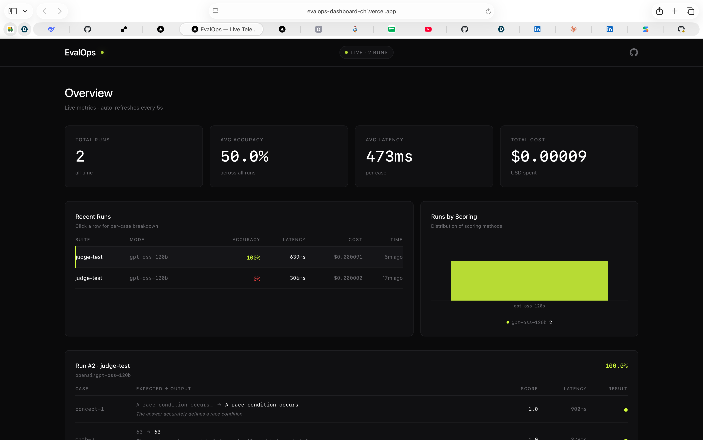
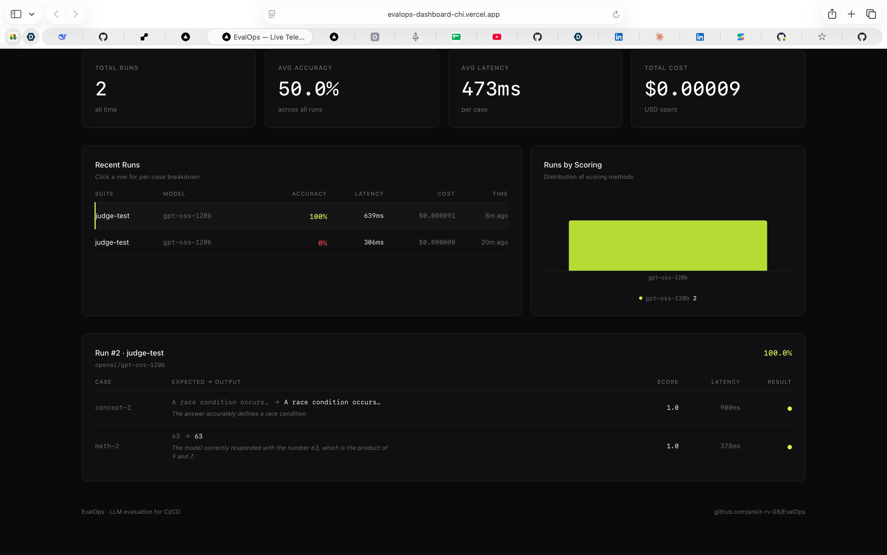
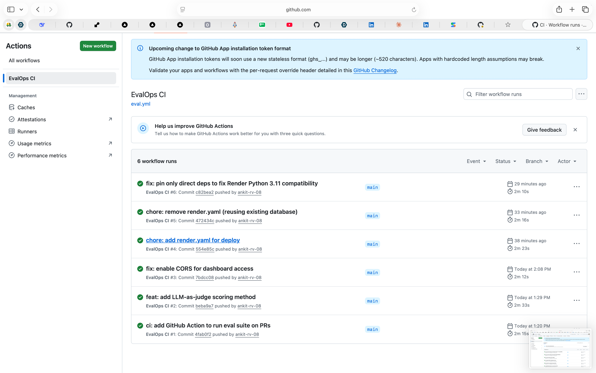

# EvalOps

**LLM evaluation harness — run test suites against any model, measure accuracy/latency/cost, block deploys on regression.**

FastAPI • Groq • PostgreSQL • SQLAlchemy • sentence-transformers • GitHub Actions

[](https://evalops-dashboard-chi.vercel.app)
[](https://evalops.onrender.com/health)
[](https://github.com/ankit-rv-08/EvalOps/actions/workflows/eval.yml)

## 🔗 Live

| Resource | URL |
|---|---|
| Dashboard | https://evalops-dashboard-chi.vercel.app |
| Backend API | https://evalops.onrender.com |
| GitHub Action | [.github/workflows/eval.yml](.github/workflows/eval.yml) |







## What it does

EvalOps is CI/CD for AI features. Just like unit tests catch bugs before deploy, EvalOps catches AI regressions before they hit users.

1. You define a test suite (JSON: input + expected output)
2. EvalOps runs each case against any LLM endpoint
3. It scores using one of four methods (see below)
4. Results persist to PostgreSQL
5. A GitHub Action blocks the deploy if accuracy drops below threshold

## Scoring methods

| Method | When to use | How it works |
|---|---|---|
| **exact_match** | Short, deterministic outputs | Output stripped + lowercased, compared to expected |
| **contains** | Keyword checks | Expected appears as a substring in output |
| **semantic_similarity** | Free-text paraphrases | Local MiniLM embeddings + cosine similarity (threshold default 0.75) |
| **llm_judge** | Open-ended reasoning | GPT-OSS-120B reads input + expected + output, returns PASS/FAIL + reasoning |

## CI/CD integration

Drop [examples/client-workflow.yml](examples/client-workflow.yml) into your repo. Set `EVALOPS_URL` as a secret. Every PR runs an eval — if accuracy drops, the build fails.

**Self-demo:** EvalOps tests itself on every push via [.github/workflows/eval.yml](.github/workflows/eval.yml).

```
Pull request opened
│
▼
GitHub Actions runs .github/workflows/eval.yml
│
▼
Starts EvalOps, hits /api/evaluate with demo-suite.json
│
▼
Checks accuracy against threshold (0.7)
│
▼
Pass → merge allowed · Fail → PR blocked
```

## API

**`POST /api/evaluate`** — run a suite

```json
{
  "suite_name": "test-1",
  "model": "openai/gpt-oss-120b",
  "scoring": "semantic_similarity",
  "threshold": 0.75,
  "cases": [
    {"id": "c1", "input": "What is 2+2?", "expected": "4"}
  ]
}
```

Response includes: `accuracy`, `passed`, `failed`, `avg_latency_ms`, `total_cost_usd`, and `per_case` breakdown with `raw_similarity` or `judge_reason`.

**`GET /api/runs`** — list recent runs
**`GET /api/runs/{id}`** — full per-case breakdown
**`GET /health`** — health check

## Status

- ☑ FastAPI + PostgreSQL + SQLAlchemy
- ☑ Four scoring methods: exact_match, contains, semantic_similarity, llm_judge
- ☑ Groq integration (GPT-OSS-120B)
- ☑ Local MiniLM embeddings (no API quota)
- ☑ Per-case persistence with judge reasoning
- ☑ Unit tests (18 passing)
- ☑ GitHub Action CI (self-testing)
- ☑ Next.js dashboard (live polling every 5s)
- ☑ Production deploy (Render backend, Vercel dashboard)

## Architecture

```
Client (dashboard or CI)
        │
        ▼
POST /api/evaluate
        │
        ▼
runner.py ──► Groq GPT-OSS-120B (or any model)
        │
        ▼
scorer.py ──► exact_match / contains / semantic_similarity / llm_judge
        │
        ▼
PostgreSQL (EvalRun + EvalCase rows)
        │
        ▼
GET /api/runs → dashboard renders live
```

## Local setup

```bash
git clone https://github.com/ankit-rv-08/EvalOps.git
cd EvalOps
python3 -m venv venv
source venv/bin/activate
pip install -r requirements.txt
cp .env.example .env  # add your GROQ_API_KEY
uvicorn app.main:app --reload --port 8000
```

## Dashboard

Separate repo: [evalops-dashboard](https://github.com/ankit-rv-08/evalops-dashboard). Consumes `/api/runs` via SWR polling. Deployed on Vercel.

## License

MIT.
